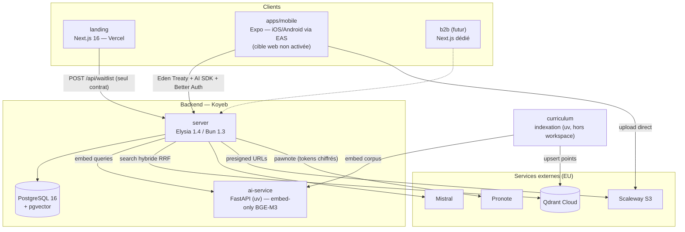
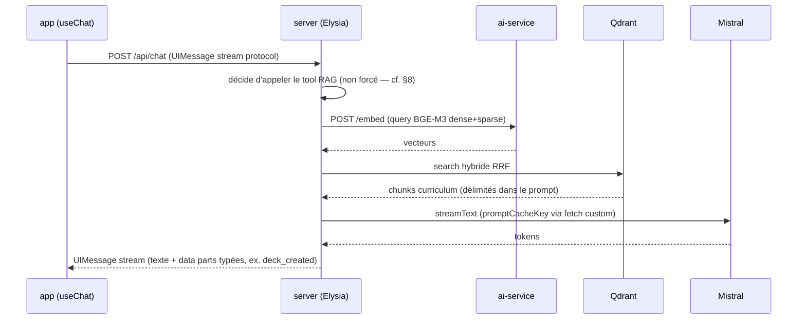
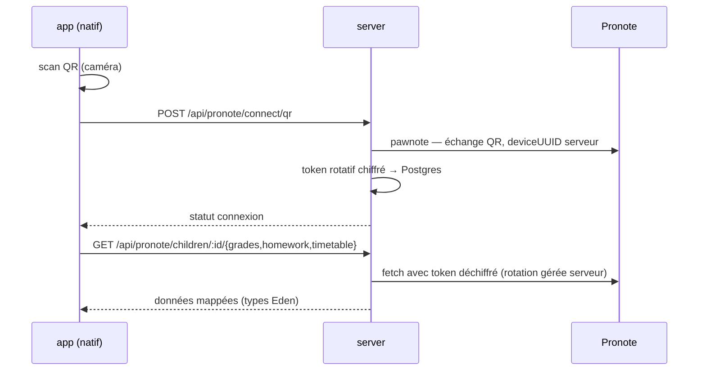
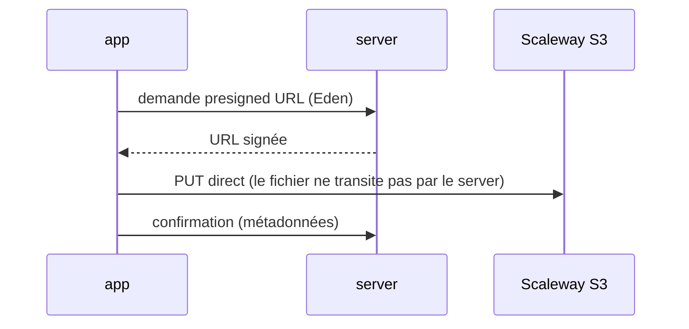
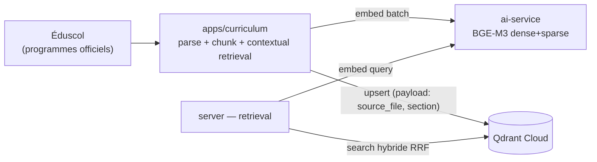

# System design — TomIA

> **Doc de référence vivant.** Décrit l'architecture **telle qu'elle est aujourd'hui**.
> Ce qui est décidé mais pas encore construit est isolé dans la section
> [8. Écarts ouverts](#8-écarts-ouverts) — jamais glissé dans le corps du document.
> Les « pourquoi » vivent dans les ADR et l'audit, jamais paraphrasés ici.
>
> Stack, versions et démarrage : `README.md`. Instructions aux agents : `CLAUDE.md`.

Décisions structurantes de référence :

- [ADR 0001 — App conso universelle](../adr/0001-universal-consumer-app.md) : une seule
  app Expo (iOS + Android + web) remplace `apps/mobile` + `apps/web` ; landing conservée ;
  B2B en Next.js dédié plus tard. `apps/web` a été supprimée le 2026-07-06 ; la cible web
  de l'app Expo n'est pas activée, et le renommage `apps/mobile` → `apps/app` que prévoyait
  l'ADR **n'a pas eu lieu** : le répertoire s'appelle toujours `apps/mobile`.
- [Audit 2026-07-01](../audits/2026-07-01-curriculum-to-frontend-architecture.md) :
  ai-service embed-only (rerank supprimé), chat sur Vercel AI SDK (ai v7), pas de package de
  logique partagée, stack backend/RAG conservée.

## 1. Contexte & acteurs

**Produit** : assistant IA scolaire socratique pour élèves, avec supervision parentale.
Pré-lancement (waitlist), zéro utilisateur en production.

**Acteurs** :

| Acteur | Accès | Parcours |
|--------|-------|----------|
| Parent | App universelle (email/password ou Google) | Dashboard, gestion enfants, Pronote, abonnement |
| Élève | App universelle (username/password) | Chat IA, révisions FSRS, fichiers, Pronote |
| Établissement | *Futur* — app Next.js B2B dédiée | Hors périmètre de ce doc |
| Visiteur | Landing | Funnel waitlist |

**Systèmes externes** (contrainte transversale : stack 100 % EU, RGPD mineurs) :

| Système | Rôle |
|---------|------|
| Mistral | Chat (`medium-latest`), embeddings 1024D, vision Pixtral, OCR, TTS + STT Voxtral |
| Qdrant Cloud | Index vectoriel RAG — source de vérité unique (dev + prod) |
| Pronote | Vie scolaire (notes/devoirs/EDT) via `pawnote`, **serveur uniquement** |
| Google OAuth | Sign-in parents |
| RevenueCat | IAP — **natif uniquement** |
| Scaleway S3 | Fichiers (presigned URLs) |
| Vercel / Koyeb / EAS | Déploiement |

## 2. Vue conteneurs & déploiement

**Conteneurs applicatifs** :

| Conteneur | Stack | Déploiement | Statut |
|-----------|-------|-------------|--------|
| `apps/landing` | Next.js 16, Tailwind 4, Framer Motion | Vercel (auto sur push) | ✅ en place |
| `apps/mobile` | Expo SDK 56, expo-router, NativeWind v5 | EAS (natif) | ✅ natif ; cible web décidée, non activée (§8) |
| `apps/server` | Elysia 1.4 / Bun 1.3, Drizzle | Koyeb | ✅ en place |
| `apps/ai-service` | FastAPI (uv), FlagEmbedding BGE-M3 | Koyeb | ✅ embed-only (Lot 3) |
| `apps/curriculum` | Python uv, hors workspace pnpm/turbo | Exécution locale/CI (batch) | ✅ en place |

`apps/web` (Next.js produit) a été **supprimée** (2026-07-06, chantier hardening lot 8),
sans portage : sous-ensemble strict du mobile, remplacée par l'app universelle (ADR 0001).

**Packages workspace** :

| Package | Rôle | Consommateurs |
|---------|------|---------------|
| `@repo/api` | Client Eden Treaty typé (`treaty<App>`) + `initializeApi`/`unwrap`/`setUnauthorizedHandler` | `apps/mobile` |
| `@repo/tokens` | Design tokens Tailwind v4 (thème clair/sombre), consommés par CSS web et NativeWind | landing, mobile |
| `@repo/ui` | Primitives shadcn/DOM | landing, futur B2B — **jamais** `apps/mobile` |

## 3. Frontends

### 3.1 Landing — frontière stricte

Vitrine marketing/SEO pré-lancement. Atomic design, JSON-LD complet, funnel waitlist.

**Contrat** : la landing ne consomme **jamais** Eden Treaty ni l'auth. Son unique point
d'intégration serveur est la Server Action `joinWaitlist` → `POST /api/waitlist`. Toute
fonctionnalité « produit » qui la tenterait appartient à l'app universelle. Cette frontière
empêche la landing de dériver vers un mini-produit.

Écart connu : aucune analytics installée (Sentry couvre les erreurs, pas l'analytics)
alors que la cible est PostHog privacy-first (cf. [§7.2](#72-observabilité)).

### 3.2 App conso (`apps/mobile`)

Une seule app Expo Router pour parents et élèves. Aujourd'hui iOS et Android ;
la troisième cible, le web (react-native-web), est décidée par l'ADR 0001 mais
n'est pas activée (§8).

**Principes** :

- **Pas de package de logique partagée** (`@repo/chat-core` abandonné) : avec une seule
  app, le code partagé, *c'est* l'app. Hooks et écrans existants servent le web tels quels.
- **Coutures plateforme** : la convention visée est `.web.ts` / `.native.ts`, mais elle
  n'est **pas** en place — un seul fichier la suit (`RevenueCatProvider.web.tsx`), et
  `Platform.OS` apparaît 21 fois dans 13 fichiers, y compris hors UI (`db/client.ts`,
  `hooks/useOfflineCache.ts`). À reprendre si la cible web est activée.
- **Navigation** : expo-router (typed routes), groupes `(auth)` / `(parent)` / `(student)`,
  gating par `Stack.Protected`.
- **État** : TanStack Query (server state) + Zustand (client state), séparation stricte.
  Offline natif : cache SQLite (expo-sqlite + Drizzle) + persister Query.
- **UI** : React Native Reusables + NativeWind v5, tokens `@repo/tokens`. Jamais `@repo/ui`
  (DOM) dans l'app.

**Capacités par plateforme** — les features natives-only dégradent explicitement sur web
(écran d'orientation, pas de fallback silencieux) :

| Capacité | Natif | Web |
|----------|-------|-----|
| Chat, dashboards, flashcards FSRS, fichiers | ✅ | ✅ |
| Pronote (connexion QR + données) | ✅ | ❌ natif-only (caméra + décision produit) |
| Abonnement RevenueCat (IAP) | ✅ | ❌ mobile-only — le web renvoie vers l'app |
| Voix (STT/TTS) | ✅ | À valider au pilote |
| Offline SQLite | ✅ | ❌ (web = online-first) |

### 3.3 B2B établissement (futur, hors périmètre)

App Next.js dédiée réutilisant `@repo/ui` + `@repo/tokens`. Le stub `/school` a disparu
avec la suppression d'`apps/web` ; rien n'est migré vers l'app universelle.

## 4. Contrats & flux

Trois contrats client↔serveur, chacun avec un rôle exclusif :

1. **Eden Treaty** (`@repo/api`) — tout le CRUD typé bout-en-bout. Les types sont dérivés
   du contrat serveur (`ResponseData<...>`), jamais redéfinis côté client.
2. **Vercel AI SDK** — le chat streaming : `streamText()` +
   `toUIMessageStreamResponse()` côté Elysia, un unique `useChat` (`@ai-sdk/react`) sur
   toutes les plateformes, événements métier (`deck_created`) en data parts typées.
   Remplace le protocole SSE maison et ses deux parseurs dupliqués (`react-native-sse`
   côté mobile, `fetch` brut côté web).
3. **Better Auth** — routes `/api/auth/*` hors Eden. Sessions : expo-secure-store (natif),
   cookies (web). Plugins : `usernameClient` (élèves), Google (idToken natif / OAuth web).
   Point dur connu si la cible web est activée : valider les cookies cross-origin Better Auth
   sur Expo web.

### 4.1 Flux chat avec RAG

Quotas et limite de streams concurrents appliqués côté serveur (`QUOTA_EXCEEDED`,
`CONCURRENT_STREAM`).

### 4.2 Flux Pronote (natif-only)

Toute la logique Pronote (lib GPL `pawnote`, tokens, rotation) vit côté serveur — jamais
dans le client. Le contexte Pronote peut être injecté dans le chat.

### 4.3 Flux upload fichiers

## 5. Backend & données

Niveau contrats/flux uniquement — pas de redesign interne (verdict audit : aucun pilier
à remplacer).

**Domaines exposés** (routes Elysia, types publiés via `App` → Eden) : `auth` (Better
Auth), `parent` (dashboard, CRUD enfants), `chat` (conversations, streaming), `pronote`,
`learning` (decks, FSRS), `files`, `subscriptions`, `waitlist`, `education` (référentiels).

**Données** (Postgres 16 + Drizzle) :

- Schéma relationnel : users/sessions (Better Auth), enfants, conversations/messages,
  decks/cartes + état FSRS, métadonnées fichiers, waitlist.
- **Chiffrement applicatif** des tokens Pronote au repos.
- pgvector présent mais le RAG curriculum vit dans **Qdrant Cloud, source de vérité
  unique** (dev + prod) — pas de dual-write.

**Garde-fous** : validation aux frontières (input user, réponses APIs externes), quotas
chat par élève, limite de streams concurrents, purge de rétention programmée.

## 6. Pipeline RAG

- **ai-service = embed-only** (Lot 3, ✅) : il n'existe que parce qu'aucun provider managé
  EU n'expose le sparse natif BGE-M3 (`lexical_weights`). Pas de rerank (aucune option EU
  viable, corpus trop petit — décision 2026-07-01). FP32 par défaut (`USE_FP16=false` — le CPU Koyeb ne gagne rien en FP16), instance unique, timeout embed.
- **Retrieval** : hybride dense+sparse, fusion RRF **native à Qdrant** via la Query API
  (prefetch dense + sparse ; stratégie `qdrant-hybrid-rrf`), chunks injectés
  délimités dans le system prompt. Gate `evaluateRagGate` (`apps/server/src/routes/learning/helpers.ts`) + rangs.
- **Écart ouvert — cycle de vie de l'index** (§8) : réindexation par `delete-by-source_file`
  (élimine les orphelins à l'update), vrai `payload.section`, procédure de veille en `.md`,
  retrait du tokenizer Mistral côté curriculum.
- **Écart ouvert — retrieval déterministe** (§8) : `toolChoice` forcé sur intent scolaire (le RAG
  ne dépend plus du bon vouloir du modèle).
- A/B restant à mener : `Modifier.IDF` on/off.

## 7. Transversal

### 7.1 Sécurité & RGPD

- **Souveraineté EU** : tous les providers IA et données sont EU (Mistral, Qdrant
  région EU, Scaleway). Critère éliminatoire pour tout nouveau provider.
- **Mineurs** : comptes élèves créés/gérés par le parent (username, pas d'email),
  reset de mot de passe par le parent, isolation des données par utilisateur au signOut
  (purge cache Query + SQLite locale).
- **Secrets** : tokens Pronote chiffrés au repos ; secrets jamais lus par les agents IA
  (permission deny) ; presigned URLs à durée courte.
- Durcissement mobile documenté mais non installé : SSL pinning, SQLCipher, App Integrity.

### 7.2 Observabilité

Cible : **Sentry** (crash/perf) + **PostHog EU** (analytics privacy-first, feature
flags, session replay).

- **Sentry : ✅ actif** (chantier hardening 2026-07-06, PR #272-279) sur server
  (`@sentry/elysia`), landing (`@sentry/nextjs`) et mobile (`@sentry/react-native`),
  scrub PII mineurs testé. La région est portée par le DSN, qui ne vit pas dans le dépôt.
- **PostHog : ⬜ à installer** (chantier séparé) — la landing n'a toujours aucune
  analytics (écart avec les règles marketing privacy-first).

### 7.3 Environnements & CI

- Dev : Docker (postgres + qdrant + ai-service, tous démarrés par défaut) + `pnpm dev`
  (landing 3001, server 3000, Expo 8081, ai-service 8001, qdrant 6333). `pnpm doctor:e2e` = diagnostic strict (toute dépendance réelle doit
  répondre, SKIP/degraded = échec). `docker-compose.yml` embarque un Qdrant local que
  `pnpm dev` attend, mais le serveur ne vise un index que si `QDRANT_URL` est renseignée —
  vide par défaut, l'index de référence étant Qdrant Cloud, partagé dev et prod (cf. `README.md`).
- CI : lint + typecheck (`--max-warnings 0`), tests unitaires + intégration server
  (gating), E2E Maestro en preview Android sur PR (signal, pas gate).
- Git : `main` seule branche permanente, branches courtes, merge commit uniquement.

## 8. Écarts ouverts

Ce qui est décidé mais pas construit. Les lots déjà livrés ne figurent plus ici :
leur trace est dans l'historique git et les PR citées.

| Écart | Décidé par | État au 2026-08-23 |
|-------|-----------|--------------------|
| `apps/mobile` est natif seul ; la cible web (react-native-web) n'est pas activée, et le renommage `apps/mobile` → `apps/app` n'a pas eu lieu | ADR 0001 | ⬜ non démarré. `apps/web` a été supprimée le 2026-07-06 sans attendre la parité, donc il n'y a aujourd'hui **aucun produit web** — seulement la landing. Point dur identifié : cookies cross-origin Better Auth sur Expo web |
| Réindexation du corpus : pas de `delete-by-source_file`, donc des points orphelins survivent à une mise à jour ; `payload.section` n'est pas renseigné | audit 2026-07-01 (lot 6) | ⬜ non démarré |
| Le RAG dépend du bon vouloir du modèle : pas de `toolChoice` forcé sur intention scolaire | audit 2026-07-01 (lot 7) | ⬜ non démarré |
| Aucune analytics installée — la landing n'a aucune télémétrie produit | règles marketing privacy-first | ⬜ non démarré. Sentry couvre les erreurs (server, landing, mobile) mais pas l'usage. Cible : PostHog EU |
| A/B `Modifier.IDF` on/off jamais mené sur le retrieval sparse | audit 2026-07-01 | ⬜ non démarré |
| Durcissement mobile absent : ni App Integrity (App Attest / Play Integrity), ni SSL pinning sur `/api/auth/*` et `/api/subscriptions/*`, ni cache SQLite chiffré (SQLCipher + persister AES, clés en SecureStore) | spec SP4 | ⬜ non démarré. L'app manipule des credentials d'enfants mineurs : c'est l'écart ouvert le plus sensible |
| Accessibilité WCAG 2.1 AA non vérifiée sur l'app (labels, rôles, contraste 4.5:1, cibles ≥ 44 px) | European Accessibility Act, en vigueur depuis juin 2025 | ⬜ non démarré. Obligation légale, pas un confort |
| Expo Router : l'auth-gating ne passe pas par `Stack.Protected`, et les écrans data-driven n'utilisent pas `useLoaderData` | patterns Expo Router v7 | ⬜ non démarré. Dette de forme, sans impact utilisateur |

Mettre cette section à jour à chaque merge qui ferme ou ouvre un écart. Quand un écart
se ferme, le retirer d'ici — ne pas le convertir en ligne « ✅ » : le corps du document
décrit alors la réalité, ce qui suffit.
