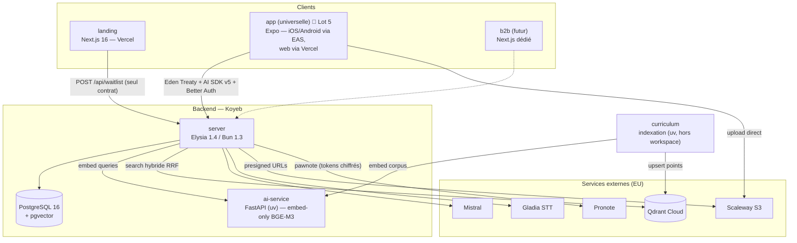
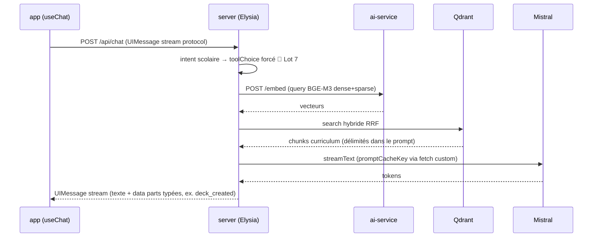
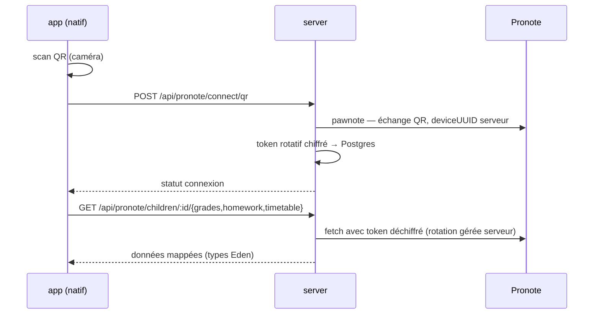
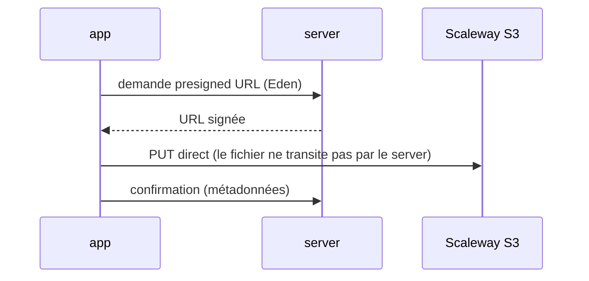
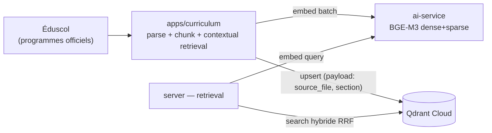

# System design — TomIA

> **Doc de référence vivant.** Décrit l'**architecture cible** du système. Tout écart
> transitoire entre l'existant et la cible porte un marqueur `🔄 Lot N` (feuille de route :
> [audit 2026-07-01](../audits/2026-07-01-curriculum-to-frontend-architecture.md)).
> Les « pourquoi » des décisions vivent dans les ADR et l'audit — jamais paraphrasés ici.
> La section [8. État vs cible](#8-état-vs-cible) se met à jour à chaque merge de lot ;
> le reste du doc est stable.

Décisions structurantes de référence :

- [ADR 0001 — App conso universelle](../adr/0001-universal-consumer-app.md) : une seule
  app Expo (iOS + Android + web) remplace `apps/mobile` + `apps/web` ; renommage
  `apps/mobile` → `apps/app` au cutover ; landing conservée ; B2B en Next.js dédié plus tard.
- [Audit 2026-07-01 (addendum)](../audits/2026-07-01-curriculum-to-frontend-architecture.md) :
  ai-service embed-only (rerank supprimé), chat sur Vercel AI SDK v5, pas de package de
  logique partagée, stack backend/RAG conservée.

## 1. Contexte & acteurs

**Produit** : assistant IA scolaire socratique pour élèves, avec supervision parentale.
Pré-lancement (waitlist), zéro utilisateur en production.

**Acteurs** :

| Acteur | Accès | Parcours |
|--------|-------|----------|
| Parent | App universelle (email/password ou Google) | Dashboard, gestion enfants, Pronote, abonnement |
| Élève | App universelle (username/password) | Chat IA, révisions FSRS, fichiers, Pronote |
| Établissement | *Futur* — app Next.js B2B dédiée | Hors périmètre de ce doc |
| Visiteur | Landing | Funnel waitlist |

**Systèmes externes** (contrainte transversale : stack 100 % EU, RGPD mineurs) :

| Système | Rôle |
|---------|------|
| Mistral | Chat (`medium-latest`), embeddings 1024D, vision Pixtral, OCR, TTS Voxtral |
| Gladia | STT |
| Qdrant Cloud | Index vectoriel RAG — source de vérité unique (dev + prod) |
| Pronote | Vie scolaire (notes/devoirs/EDT) via `pawnote`, **serveur uniquement** |
| Google OAuth | Sign-in parents |
| RevenueCat | IAP — **natif uniquement** |
| Scaleway S3 | Fichiers (presigned URLs) |
| Vercel / Koyeb / EAS | Déploiement |

## 2. Vue conteneurs & déploiement

**Conteneurs applicatifs cibles** :

| Conteneur | Stack | Déploiement | Statut |
|-----------|-------|-------------|--------|
| `apps/landing` | Next.js 16, Tailwind 4, Framer Motion | Vercel (auto sur push) | ✅ en place |
| `apps/app` | Expo SDK 56, expo-router, NativeWind v5 | EAS (natif) + Vercel (export web statique) | 🔄 Lot 5 — aujourd'hui `apps/mobile`, natif seul |
| `apps/server` | Elysia 1.4 / Bun 1.3, Drizzle | Koyeb | ✅ en place |
| `apps/ai-service` | FastAPI (uv), FlagEmbedding BGE-M3 | Koyeb | ✅ embed-only (Lot 3) |
| `apps/curriculum` | Python uv, hors workspace pnpm/turbo | Exécution locale/CI (batch) | ✅ en place |

`apps/web` (Next.js produit) existe encore mais est **legacy** : supprimée en bloc au
cutover du Lot 5, sans portage (sous-ensemble strict du mobile — cf. ADR 0001).

**Packages workspace** :

| Package | Rôle | Consommateurs |
|---------|------|---------------|
| `@repo/api` | Client Eden Treaty typé (`treaty<App>`) + `initializeApi`/`unwrap`/`setUnauthorizedHandler` | app universelle (web legacy en transition) |
| `@repo/tokens` | Design tokens Tailwind v4 (thème clair/sombre), consommés par CSS web et NativeWind | landing, app, web legacy |
| `@repo/ui` | Primitives shadcn/DOM | landing, futur B2B — **jamais** l'app universelle |

## 3. Frontends

### 3.1 Landing — frontière stricte

Vitrine marketing/SEO pré-lancement. Atomic design, JSON-LD complet, funnel waitlist.

**Contrat** : la landing ne consomme **jamais** Eden Treaty ni l'auth. Son unique point
d'intégration serveur est la Server Action `joinWaitlist` → `POST /api/waitlist`. Toute
fonctionnalité « produit » qui la tenterait appartient à l'app universelle. Cette frontière
empêche la landing de dériver vers un mini-produit.

Écart connu : aucune analytics installée alors que la cible est PostHog privacy-first
(cf. [§7.2](#72-observabilité)).

### 3.2 App universelle (`apps/app`) 🔄 Lot 5

Une seule app Expo Router pour parents et élèves, trois cibles : iOS, Android, web
(react-native-web). Roadmap d'exécution :
[plan de migration](../superpowers/plans/2026-06-30-universal-app-migration.md)
(pilote chat web → parité → cutover atomique → réconciliation doc).

**Principes** :

- **Pas de package de logique partagée** (`@repo/chat-core` abandonné) : avec une seule
  app, le code partagé, *c'est* l'app. Hooks et écrans existants servent le web tels quels.
- **Coutures plateforme** via la convention `.web.ts` / `.native.ts` (streaming, storage,
  auth token) — jamais de `Platform.OS` disséminé dans la logique métier.
- **Navigation** : expo-router (typed routes), groupes `(auth)` / `(parent)` / `(student)`,
  gating par `Stack.Protected`.
- **État** : TanStack Query (server state) + Zustand (client state), séparation stricte.
  Offline natif : cache SQLite (expo-sqlite + Drizzle) + persister Query.
- **UI** : React Native Reusables + NativeWind v5, tokens `@repo/tokens`. Jamais `@repo/ui`
  (DOM) dans l'app.

**Capacités par plateforme** — les features natives-only dégradent explicitement sur web
(écran d'orientation, pas de fallback silencieux) :

| Capacité | Natif | Web |
|----------|-------|-----|
| Chat, dashboards, flashcards FSRS, fichiers | ✅ | ✅ |
| Pronote (connexion QR + données) | ✅ | ❌ natif-only (caméra + décision produit) |
| Abonnement RevenueCat (IAP) | ✅ | ❌ mobile-only — le web renvoie vers l'app |
| Voix (STT/TTS) | ✅ | À valider au pilote |
| Offline SQLite | ✅ | ❌ (web = online-first) |

### 3.3 B2B établissement (futur, hors périmètre)

App Next.js dédiée réutilisant `@repo/ui` + `@repo/tokens`. Le stub `/school` d'`apps/web`
disparaît avec elle ; rien n'est migré vers l'app universelle.

## 4. Contrats & flux

Trois contrats client↔serveur, chacun avec un rôle exclusif :

1. **Eden Treaty** (`@repo/api`) — tout le CRUD typé bout-en-bout. Les types sont dérivés
   du contrat serveur (`ResponseData<...>`), jamais redéfinis côté client.
2. **Vercel AI SDK v5** 🔄 Lot 4 — le chat streaming : `streamText()` +
   `toUIMessageStreamResponse()` côté Elysia, un unique `useChat` (`@ai-sdk/react`) sur
   toutes les plateformes, événements métier (`deck_created`) en data parts typées.
   Remplace le protocole SSE maison et ses deux parseurs dupliqués (`react-native-sse`
   côté mobile, `fetch` brut côté web).
3. **Better Auth** — routes `/api/auth/*` hors Eden. Sessions : expo-secure-store (natif),
   cookies (web). Plugins : `usernameClient` (élèves), Google (idToken natif / OAuth web).
   Le point dur du Lot 5 : valider les cookies cross-origin Better Auth sur cible Expo web
   au pilote.

### 4.1 Flux chat avec RAG (cible Lot 4 + Lot 7)

Quotas et limite de streams concurrents appliqués côté serveur (`QUOTA_EXCEEDED`,
`CONCURRENT_STREAM`).

### 4.2 Flux Pronote (natif-only)

Toute la logique Pronote (lib GPL `pawnote`, tokens, rotation) vit côté serveur — jamais
dans le client. Le contexte Pronote peut être injecté dans le chat.

### 4.3 Flux upload fichiers

## 5. Backend & données

Niveau contrats/flux uniquement — pas de redesign interne (verdict audit : aucun pilier
à remplacer).

**Domaines exposés** (routes Elysia, types publiés via `App` → Eden) : `auth` (Better
Auth), `parent` (dashboard, CRUD enfants), `chat` (conversations, streaming), `pronote`,
`learning` (decks, FSRS), `files`, `subscriptions`, `waitlist`, `education` (référentiels).

**Données** (Postgres 16 + Drizzle) :

- Schéma relationnel : users/sessions (Better Auth), enfants, conversations/messages,
  decks/cartes + état FSRS, métadonnées fichiers, waitlist.
- **Chiffrement applicatif** des tokens Pronote au repos.
- pgvector présent mais le RAG curriculum vit dans **Qdrant Cloud, source de vérité
  unique** (dev + prod) — pas de dual-write.

**Garde-fous** : validation aux frontières (input user, réponses APIs externes), quotas
chat par élève, limite de streams concurrents, purge de rétention programmée.

## 6. Pipeline RAG

- **ai-service = embed-only** (Lot 3, ✅) : il n'existe que parce qu'aucun provider managé
  EU n'expose le sparse natif BGE-M3 (`lexical_weights`). Pas de rerank (aucune option EU
  viable, corpus trop petit — décision 2026-07-01). FP16, instance unique, timeout embed.
- **Retrieval** : hybride dense+sparse fusionné par RRF côté server, chunks injectés
  délimités dans le system prompt. Gate `hasValidResults` + rangs (Lot 1, ✅).
- 🔄 **Lot 6 — cycle de vie de l'index** : réindexation par `delete-by-source_file`
  (élimine les orphelins à l'update), vrai `payload.section`, procédure de veille en `.md`,
  retrait du tokenizer Mistral côté curriculum.
- 🔄 **Lot 7 — retrieval déterministe** : `toolChoice` forcé sur intent scolaire (le RAG
  ne dépend plus du bon vouloir du modèle).
- A/B restant à mener : `Modifier.IDF` on/off.

## 7. Transversal

### 7.1 Sécurité & RGPD

- **Souveraineté EU** : tous les providers IA et données sont EU (Mistral, Gladia, Qdrant
  région EU, Scaleway). Critère éliminatoire pour tout nouveau provider.
- **Mineurs** : comptes élèves créés/gérés par le parent (username, pas d'email),
  reset de mot de passe par le parent, isolation des données par utilisateur au signOut
  (purge cache Query + SQLite locale).
- **Secrets** : tokens Pronote chiffrés au repos ; secrets jamais lus par les agents IA
  (permission deny) ; presigned URLs à durée courte.
- Durcissement mobile documenté mais non installé : SSL pinning, SQLCipher, App Integrity.

### 7.2 Observabilité

Cible : **Sentry** (crash/perf, les 4 apps) + **PostHog EU** (analytics privacy-first,
feature flags, session replay). Statut : **à installer** — aucun des deux n'est présent,
et la landing n'a aucune analytics (écart avec les règles marketing privacy-first).
À câbler au plus tard pendant le Lot 5 (le pilote web a besoin de télémétrie pour le
go/no-go).

### 7.3 Environnements & CI

- Dev : Docker (Postgres) + `pnpm dev` (landing 3001, web 3002, server 3000, Expo 8081,
  ai-service 8001). `pnpm doctor:e2e` = diagnostic strict (toute dépendance réelle doit
  répondre, SKIP/degraded = échec). Qdrant Cloud partagé dev/prod (pas d'instance locale).
- CI : lint + typecheck (`--max-warnings 0`), tests unitaires + intégration server
  (gating), E2E Maestro en preview Android sur PR (signal, pas gate).
- Git : `main` seule branche permanente, branches courtes, merge commit uniquement.

## 8. État vs cible

Seule section à mettre à jour à chaque merge de lot.

| # | Écart existant → cible | Lot | Statut |
|---|------------------------|-----|--------|
| 1 | Scoring RAG/flashcards cassés → gate `hasValidResults`, rangs | 1 | ✅ mergé (#262) |
| 2 | Deps sécu (Better Auth 1.6.23) | 2 | ✅ mergé (#265) |
| 3 | ai-service avec rerank + risque OOM → embed-only FP16 | 3 | ✅ mergé (#266) |
| 4 | SSE maison + 2 parseurs dupliqués → Vercel AI SDK v5 (serveur puis clients) | 4 | ⬜ à faire |
| 5 | `apps/mobile` natif + `apps/web` doublon → `apps/app` universelle, suppression `apps/web`, renommage | 5 | ⬜ à faire (ADR + plan écrits) |
| 6 | Orphelins d'index à l'update → delete-by-`source_file`, `payload.section` | 6 | ⬜ à faire |
| 7 | RAG au bon vouloir du modèle → `toolChoice` forcé sur intent scolaire | 7 | ⬜ à faire |
| 8 | Zéro observabilité → Sentry + PostHog EU (dont analytics landing) | — | ⬜ à câbler (au plus tard pendant Lot 5) |

Après cutover Lot 5 : réconcilier ce doc (renommages `apps/app`), le `CLAUDE.md` racine
et supprimer les specs web supersedées (Phase 4 du plan de migration).
